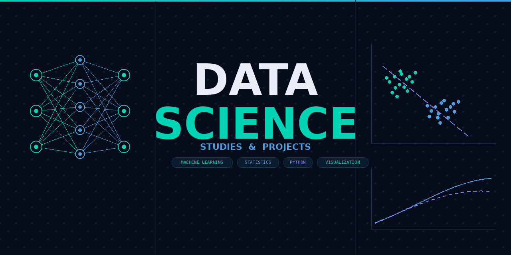

# thinkatlas

Bem-vindo ao ThinkAtlas, aqui jaz toda a minha revisão de tópicos da área de Data Science. Eu
pedi para a IA da `Anthropic`, o `Claude`, criar um plano de estudos personalizado que me faça
relembrar todos os tópicos importantes para essa jornada. Junto a esses exercícios, também estou
colocando em prática os exercícios propostos no `Clube Núcleo` do `Dr. Petrus`. Planejo também,
em cursos e estudos posteriores, também imortalizá-los aqui

# Overview

O `Claude` criou um plano de estudos composto por 8 fases, cada fase incluindo diversos exercícios:

- Fase 0 - Fundamentos da programação
- Fase 1 - Fundamentos da matemática
- Fase 2 - Análise de dados e SQL
- Fase 3 - Estatística e Probabilidade
- Fase 4 - Machine Learning Clássico
- Fase 5 - Deep learning e NLP
- Fase 6 - Produção & Engenharia
- Fase 7 - Portfólio & Empregabilidades